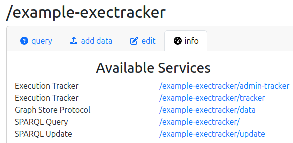
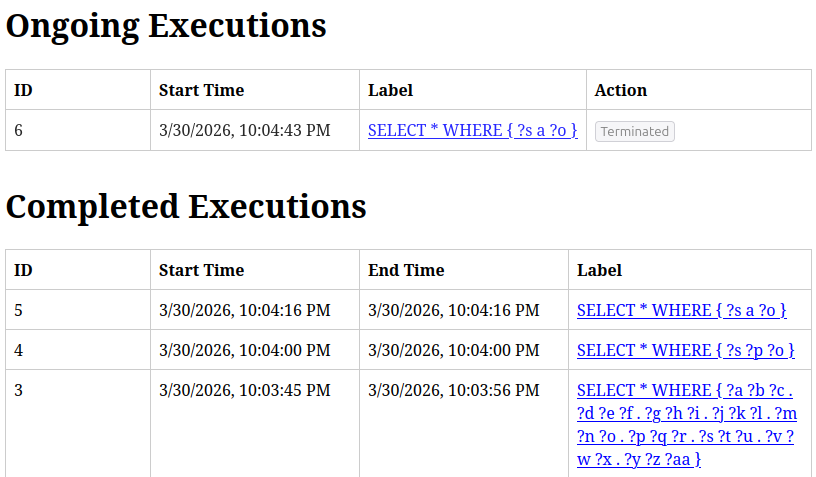

## Example Fuseki Setup

This directory contains an example setup for running Jena ExecTracker with Apache Fuseki.

### Quick Start

```bash
# Setup Fuseki with ExecTracker plugin and example data
$ make setup-example
------------------------
Fuseki set up! Start it with:

(cd target/fuseki && ./fuseki-server --config=run/config.ttl --port 3030)

The ExecTracker UI will be available at http://localhost:3030/example-exectracker/tracker

Querying the endpoint will show ongoing executions in the ExecTracker UI.

curl http://localhost:3030/example-exectracker/query -G --data-urlencode 'query=SELECT * { ?s ?p ?o } LIMIT 2'

And so will updates:

curl -X POST http://localhost:3030/example-exectracker/update -u 'test:test' --data-urlencode 'update=INSERT DATA { <x> <y> <z> }'
```

### Setup Details

The `make setup-example` command:

1. Downloads Apache Jena Fuseki 6.0.0
2. Copies the ExecTracker Fuseki plugin JAR to Fuseki's `run/extra/` directory
3. Installs the configuration files (`config.ttl`, `passwd.txt`, `example-exectracker.service.ttl`, `mona-lisa.ttl`)
4. Sets up the example RDF data

### Configuration

The example uses these configuration files:

| File | Description |
|------|-------------|
| `config.ttl` | Fuseki server configuration (enables basic authentication) |
| `passwd.txt` | User credentials (`test:test`) |
| `exectracker-demo_ds.ttl` | ExecTracker service configuration |
| `mona-lisa.ttl` | Example RDF data (Bob + Mona Lisa) |

### ExecTracker Endpoints

The example setup provides two ExecTracker endpoints:

| Endpoint | URL | Description |
|----------|-----|-------------|
| `tracker` | `/example-exectracker/tracker` | Public endpoint to view SPARQL executions (read-only) |
| `admin-tracker` | `/example-exectracker/admin-tracker` | Protected endpoint with abort permission (user: `test`) |

### Example Queries

```bash
# Query the dataset
curl http://localhost:3030/example-exectracker/query -G --data-urlencode 'query=SELECT * { ?s ?p ?o } LIMIT 2'

# Update the dataset (requires authentication)
curl -X POST http://localhost:3030/example-exectracker/update -u 'test:test' --data-urlencode 'update=INSERT DATA { <x> <y> <z> }'

# Access the ExecTracker dashboard
open http://localhost:3030/example-exectracker/tracker
```

### ExecTracker Dashboard

The ExecTracker dashboard shows active and completed query executions.

<table>
  <tr>
    <td align="center">
      
      <br><em>Services</em>
    </td>
    <td align="center">
      
      <br><em>Dashboard</em>
    </td>
  </tr>
</table>
